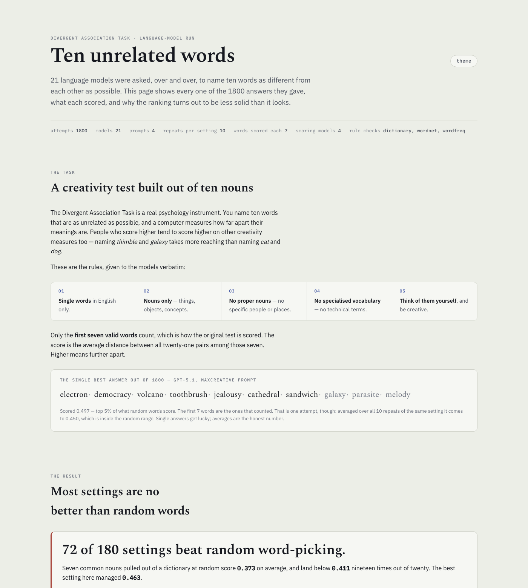
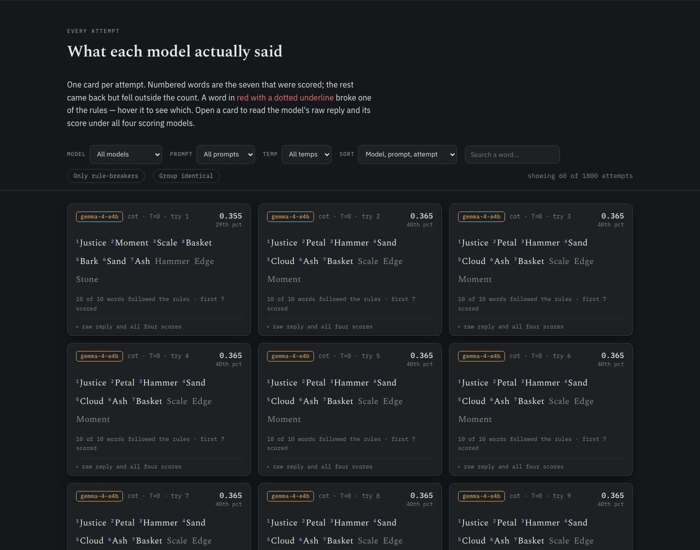

# dat-bench

**21 language models took the same 10-word creativity test 1800 times, scored by four
different embedding models. A maintained harness for replicating — and stress-testing —
the published DAT-on-LLM results.**

> **This is a replication harness, not a new result.** The DAT has been run on LLMs since
> 2023 and two 2026 papers already report its central weaknesses. See
> [Related work](#related-work) before quoting anything here as a finding.

[](https://github.com/yadavnarun/dat-bench/actions/workflows/tests.yml)
[](https://yadavnarun.github.io/dat-bench/)
[](LICENSE)

### → **[Explore all 1800 answers](https://yadavnarun.github.io/dat-bench/)** ←

[](https://yadavnarun.github.io/dat-bench/)

---

## The test

The [Divergent Association Task](https://www.datcreativity.com/task) is a real
psychology instrument ([Olson, Nahas, Chmoulevitch, Cropper & Webb, *PNAS* 2021](https://doi.org/10.1073/pnas.2022340118),
validated on 8,914 participants). You name **ten words as different from
each other as possible**; a computer measures how far apart their meanings are. Naming
*thimble* and *galaxy* takes more reaching than naming *cat* and *dog*, and in humans
that reaching correlates with other creativity measures.

21 models each did it **1800 times**: 4 prompt variants × up to 3 temperatures × 10
repeats. Every answer, every word, every score is in this repo.

## What this run found

### 1. Individual ranks are unstable; the generational trend is contested

Four embedding models scored the same 1800 answers and ranked all 21 contestants.
Individual placings move wildly:

| model | gemma-300m | nomic | qwen3-0.6b | qwen3-4b | rank swing |
|---|---|---|---|---|---|
| `lfm2.5-1.2b` | **1st** | 21st | 21st | 21st | **±20** |
| `gpt-4o-mini` | 21st | 16th | **1st** | 2nd | **±20** |
| `gemma-4-e4b` | 10th | 13th | 3rd | 20th | ±17 |
| `gpt-5.1` | 2nd | 1st | 4th | 1st | ±3 |

Only **5 of 21** models hold their position within 3 places across all four scorers.

**The rank-correlation numbers are much weaker evidence than they look.** Point estimates
run +0.04 to +0.85 across the 6 scorer pairs, but bootstrap 95% CIs (resampling models,
5000 draws) are about a full unit wide:

| pair | ρ | 95% CI |
|---|---|---|
| gemma-300m ↔ qwen3-0.6b | +0.042 | [−0.49, +0.54] |
| qwen3-0.6b ↔ qwen3-4b | +0.765 | [+0.44, +0.94] |

**4 of the 6 pairs are statistically consistent with the ρ = +0.73 that Nakajima et al.
report for SBERT-vs-GloVe.** At n=21 these correlations cannot distinguish "the scorers
disagree badly" from "the scorers agree as much as published work says". The *rank swings*
above are direct observations and stand; the correlation is not resolvable here.

**But the aggregate trend survives.** Comparing like-for-like — the 11 *base* OpenAI
models, without mixing in the nano/mini/search variants — every scorer agrees that newer
models score higher:

| | gemma-300m | nomic | qwen3-0.6b | qwen3-4b | pooled |
|---|---|---|---|---|---|
| ρ(generation, score) | +0.817 | +0.596 | +0.220 | **+0.642** | **+0.743** (p=0.011) |

Much of the rank chaos above comes from **mixing model tiers**, not from the scorers
disagreeing about capability. Size is where they genuinely contradict each other:
ρ(nano→mini→base, score) is **−0.73** under one scorer and **+0.78** under another.

**And published work disagrees with the trend.** Haase et al. (*Journal of Creativity*
35(3), 2025) ran 14 models × 100 trials and found **no** creative improvement over
18–24 months; NoveltyBench finds larger models within a family are often *less* diverse.
Our +0.74 has to be argued against those, not reported over them — and the most likely
difference is our like-for-like base-model restriction, which is a choice we made, not a
fact we found.

The honest summary: `gpt-5.1` is top-3 under all four scorers and `gpt-5-mini` bottom-5
under all four. The ordering in between is not recoverable from this data, and the
generational trend is a live disagreement rather than a result.

### 2. Most answers are no better than random words — *replicating Nakajima et al. 2026*

Seven common nouns pulled from a dictionary at random are the bar, and most answers do
not clear it. How badly depends on who is scoring — which is itself the point:

| scorer | cells beating chance p95 | models beating it |
|---|---|---|
| `nomic-embed-text-v1.5` | 12 / 180 | **0 / 21** |
| `embeddinggemma-300m` | 15 / 180 | **0 / 21** |
| `qwen3-embedding-0.6b` | 36 / 180 | 1 / 21 |
| `qwen3-embedding-4b` | **72 / 180** | 6 / 21 |

Only **2 of 180** cells clear chance under *all four*. Two of the scorers place **no
model at all** above their own 95th percentile — they have almost no headroom above chance,
so a strong-looking correlation on those scorers describes models climbing *up to* chance,
never past it.

The models clearly understand the task — they score far above what naming seven animals
gets you — but "beats chance" is not a scorer-independent verdict here.

**This is a replication, not a discovery.** Nakajima et al. (Findings of EACL 2026) state
it as their central claim: under a stronger embedder and stronger baselines, LLM DAT
scores fall *below* baselines with no creative ability at all. Our contribution is the
per-embedder version of their baseline. This is why the
harness computes a **random-noun baseline per scorer** and reports every score as a
percentile against it. Without that reference, "0.44 beats 0.42" reads like a result.

### 3. Independent models converge on the same words — *replicating Wenger & Kenett 2026*

Across all 1800 runs there are only **797 distinct words**. `chair` and `pillow` appear
in **all 21 models**; `mountain`, `apple`, `river`, `thunder`, `cloud`, `justice` and
`hammer` in 20 of 21 — despite every model being told to *"think of the words on your
own."* Meanwhile **46%** of the vocabulary comes from a single model.

Repetition within a model is just as stark: `lfm2.5-1.2b` used **45 different words to
fill 1194 slots**, and `gpt-5.4` used 97 across 1200 — fewer than `gpt-4o`'s 198, despite
being newer. None of this shows up in the score.

**Already established.** Wenger & Kenett's paper is titled *Large language models are
homogeneously creative* and does the cross-model word-overlap analysis on the DAT across
22 models. Bellemare-Pepin et al. report the per-model version with harder numbers than
ours — GPT-4 used *microscope* in 70% of responses, GPT-4-turbo used *ocean* in over 90%,
against humans at *car* 1.4%. Our 797-distinct-words figure is a clean replication.

[](https://yadavnarun.github.io/dat-bench/)

*Nine consecutive attempts by the same model at temperature 0, returning an identical
answer each time. Ten "measurements" carrying the information of one.*

### 4. Which prompt "wins" depends on who is scoring

Telling a model it is scored on embedding distance (`maxcreative`) beats a
think-step-by-step prompt (`cot`) by +0.013 under `qwen3-0.6b` (t(20)=+2.76, 16/21 models
improve) and +0.009 under `qwen3-4b` (t(20)=+2.99, 15/21) — but **loses** to `cot` by
−0.014 under `nomic` (t(20)=−4.39, only 4/21 improve). The same paired test, significant
in opposite directions, on identical answers.

Of the four, this is the one the literature search did **not** turn up elsewhere: papers
with a prompt grid score under one embedder, and papers with multiple embedders have no
prompt grid. Treat it as provisional — it is a corollary of scorer-dependence that others
already flag, and a paired test flipping sign is also what small effects plus multiple
comparisons produce. It needs a multiple-comparison correction before it is a finding.

Temperature, by contrast, does nothing to score level: paired T=1.0 vs T=0.0 gives
d = −0.0002 (dz = −0.05) while within-cell variance quadruples. Note this **conflicts**
with Bellemare-Pepin et al., who report higher temperature raising DAT scores — they went
to 1.5 and we capped at 1.0, which is testable and untested here.

## What the numbers are not

Scoring uses **local embedding models via LM Studio**, not the GloVe 840B-300d vectors
the published test uses. That is a deliberate trade (no 2GB download) and it costs
comparability:

- Scores are on an **arbitrary scale** and are **not comparable** to the published human
  norms (mean ≈78). No number here is multiplied by 100, so nothing looks like one.
- The local scorers agree with GloVe on *near* word pairs (`cat`/`dog`: 0.204 vs 0.198)
  but **compress the far end ~2.2×** (`cat`/`thimble`: 0.396 vs 0.879) — exactly where
  this test discriminates. Run `scripts/premise_check.py` to reproduce.
- **This is not a creativity measure.** The DAT's validity comes from correlating with
  human creativity *in humans*. That does not transfer to language models.

Every one of these appears in the generated report, not just here.

## Run it

```bash
git clone https://github.com/yadavnarun/dat-bench && cd dat-bench
scripts/make_report.sh --open
```

One command, cold start: creates the venv, installs deps, fetches WordNet, checks
[LM Studio](https://lmstudio.ai) is up with an embedding model loaded, runs the pipeline,
and opens the explorer. Or stage by stage — each is idempotent:

```bash
python -m datbench models          # which models are live, and why the rest aren't
python -m datbench run --n 10      # the factorial (resumable)
python -m datbench score           # parse -> validate -> embed -> score
python -m datbench analyze
python -m datbench report --html
```

**Requires** [LM Studio](https://lmstudio.ai) on `:1234` with an embedding model loaded.
API keys only for whichever cloud models you want; local models need none.

### Adding a model is four lines

Every provider here speaks the OpenAI wire format, so the only per-provider facts are the
URL and the key's env var:

```yaml
  - id: my-model
    model: vendor/model-name
    base_url: https://api.vendor.com/v1
    api_key_env: VENDOR_API_KEY
```

An entry whose key is unset stays **inert** — skipped with a reason naming the variable,
never aborting the run. So cloud entries ship pre-populated and activate the moment you
add a key.

## How it works

```
prompts/*.txt ─┐
models.yaml ───┴─> runner ──> runs/responses.jsonl        (append-only, resumable)
                                     │
                     parse ──> validate ──> out/words.jsonl
                                     │
              embed (LM Studio + sqlite cache) ──> score ──> out/scores.jsonl
                                     │                       out/baselines.json
                              analyze ──> report ──> docs/report.html
                                     └──> build_explorer ──> docs/index.html
```

Two phases on purpose: `run` collects raw replies, then `score`/`analyze` are pure
functions over them. So you can **re-score with a different embedder or validity policy
without re-paying a single API call**, and an interrupted run resumes for free.

`run_id = sha1(model|prompt|temperature|replicate)[:16]` joins every artifact and makes
resume idempotent.

| | |
|---|---|
| `datbench/providers.py` | one OpenAI-compatible client, every provider |
| `datbench/runner.py` | factorial loop, resumable, per-model concurrency |
| `datbench/parse.py` | model reply → candidate words |
| `datbench/validate.py` | the task's five rules |
| `datbench/embed.py` | LM Studio embeddings + sqlite cache |
| `datbench/score.py` | the score, plus chance baseline and category floors |
| `datbench/analyze.py` | bootstrap CIs, Jaccard, Spearman (no scipy) |
| `datbench/report.py` | markdown + HTML |
| [`CONTRACT.md`](CONTRACT.md) | the module interface authority — read before editing |
| [`docs/design.md`](docs/design.md) | design rationale and rejected alternatives |

**453 tests, all network-free.** Every provider and embedder call is faked, so CI
exercises the same paths a real run does without spending anything.

## Design decisions worth stealing

Most of these exist because the first version of the benchmark quietly lied.

- **A refused run is never scored 0.** Zero is a floor that rewards invalid output.
  Refused runs are excluded and counted visibly instead.
- **Validity rate is reported beside every score.** A model can inflate its score with
  rare or technical words, which breaks the task's own rules. `gaming_index =
  score × valid_rate` sits next to the raw number, never instead of it.
- **Deterministic cells are flagged, not given a confidence interval.** At temperature 0
  ten identical replies produce a zero-width CI that looks like extreme precision but
  rests on one observation. Those read `[degenerate: n_eff=1]`.
- **Truncation is counted separately from failure.** A reasoning model that spends its
  whole token budget thinking returns an *empty* message with no error — indistinguishable
  from a model that answered badly. `gpt-5` needs 3169 output tokens; at a 3072 cap it
  returns nothing, on every run.
- **Robustness verdicts are refused when the sample can't support them.** Spearman ρ over
  two models is always ±1, so the report says "cannot be assessed" rather than laundering
  a tautology as a robustness check.
- **`validate.capabilities()` is printed in every report** — which rule checks actually
  loaded, so a degraded run can't be mistaken for a clean one.

## The data

| file | what |
|---|---|
| `data/responses.jsonl` | every raw model reply — the part that cost real API calls. A committed snapshot of `runs/responses.jsonl`, which is the working file the pipeline appends to |
| `data/summary.json` / `.csv` | per-model and per-cell aggregates |
| `data/baselines.json` | chance distribution + category floors, per scorer |

`out/words.jsonl` and `out/scores.jsonl` are derived and regenerate from the responses
with `python -m datbench score`, so they are not committed. `responses.jsonl` is
append-only, so it holds a few superseded rows from retried calls — the pipeline resolves
each `run_id` to its newest row, and so should you.

## Related work

The DAT has been applied to LLMs since 2023, and this project independently rebuilt a
design that already exists. Read these before treating anything above as new.

**The prior art that matters most**

- **Nakajima, Zuiderveld & Pezzelle (2026).** *Beyond Divergent Creativity: A Human-Based
  Evaluation of Creativity in Large Language Models.* Findings of EACL 2026.
  [arXiv:2601.20546](https://arxiv.org/abs/2601.20546) — 15 LLMs × 500 responses × 3
  temperatures, four embedders, a WordNet random-noun baseline, and a validity filter
  near-identical to ours. **Our finding 2 is their headline claim**, seven months earlier.
- **Bellemare-Pepin, Lespinasse, Thölke, Harel, Mathewson, Olson, Bengio & Jerbi (2026).**
  *Divergent creativity in humans and large language models.* Scientific Reports 16:1279.
  [doi:10.1038/s41598-025-25157-3](https://doi.org/10.1038/s41598-025-25157-3) — the
  prompt × temperature × repeat DAT design we rebuilt, at 500 samples per model per
  condition against 100k humans, co-authored by an original DAT author. Code:
  [github.com/AntoineBellemare/DAT_GPT](https://github.com/AntoineBellemare/DAT_GPT),
  whose README notes its scripts are now outdated and no longer reproducible — which is
  the clearest statement of what this repo actually contributes.
- **Wenger & Kenett (2026).** *Large language models are homogeneously creative.* PNAS
  Nexus 5(3) pgag042 — 22 LLMs with explicit cross-model word overlap on the DAT.
  **Our finding 3 is this paper's title.**
- **Schapiro, Gladstone, Black & Ji (2026).** *Assessing the Creativity of Large Language
  Models.* [arXiv:2605.13450](https://arxiv.org/abs/2605.13450) — up to 54 models across
  GloVe, fastText and SBERT with per-embedder reporting. Already publishes the rationale
  for scoring under multiple embedders.
- **Haase, Hanel & Pokutta (2025).** *Has the Creativity of Large-Language Models peaked?*
  Journal of Creativity 35(3). [arXiv:2504.12320](https://arxiv.org/abs/2504.12320) —
  14 models, 2,800 DAT evaluations, finds **no** generational improvement. Directly
  contradicts our finding 1.

**Also relevant**

- Chen & Ding (2023), *Probing the "Creativity" of Large Language Models*, Findings of
  EMNLP 2023 ([arXiv:2310.11158](https://arxiv.org/abs/2310.11158)) — first dedicated
  LLM-DAT paper.
- Cropley (2023), *Is artificial intelligence more creative than humans?*, Learning
  Letters 2 — earliest LLM-DAT result.
- Beaty & Johnson (2021), *SemDis*, Behavior Research Methods 53(2) — five semantic spaces
  combined into a latent factor. Multi-space scoring has been standard human psychometrics
  since 2021; the field's answer to scorer variance was a composite, not divergent
  rankings.
- Jiang et al. (2025), *Artificial Hivemind*, NeurIPS 2025 D&B (oral)
  ([arXiv:2510.22954](https://arxiv.org/abs/2510.22954)) — inter-model homogeneity at
  scale, 71–82% cross-model response similarity.
- Zhang et al. (2025), *NoveltyBench*
  ([arXiv:2504.05228](https://arxiv.org/abs/2504.05228)) — mode collapse as a benchmark.
- Hou et al. (2026), *CreativityPrism*, TMLR
  ([arXiv:2510.20091](https://arxiv.org/abs/2510.20091)) — 17-model umbrella benchmark
  that includes the DAT.
- Haase, Hanel & Pokutta (2025), *S-DAT*
  ([arXiv:2505.09068](https://arxiv.org/abs/2505.09068)) — multilingual transformer
  embeddings replacing GloVe.
- Organisciak et al., *Beyond semantic distance*, Thinking Skills and Creativity (2023) —
  argues LLM judges outperform embedding distance for divergent-thinking scoring.

### So what is actually new here?

Honestly: not much, and nothing headline. In descending order of defensibility —

1. **The prompt-effect sign reversal** (finding 4). Not found elsewhere; provisional.
2. **The per-embedder chance baseline** as a reporting unit. Nakajima et al. have the
   random-noun baseline; recomputing it per scorer and reporting percentiles against each
   scorer's own baseline appears not to be published.
3. **A maintained harness on a current roster.** The closest public artifact declares
   itself unreproducible. This is engineering value, not a research claim.

**Not new, and not claimed:** the DAT-on-LLMs design, multi-embedder scoring, validity
filtering, mode-collapse measurement, or any "first" or "largest" — at 21 models and 1800
runs this is mid-pack against 54 models, 22 models, and one study with 215,542
observations.

## Limitations

Beyond the scale caveats above: the `rare` flag is a weak proxy for "specialised
vocabulary" (Zipf rates *thimble* 2.53 — correctly valid, it is the paper's own example —
but *quark* 3.05, so technical words slip through); temperature is not comparable across
providers, and several reasoning models reject it outright; n=10 gives wide per-cell CIs,
and the headline best-cell figure is a maximum over correlated estimates, labelled as such
in the report.

---

Task from Olson, Nahas, Chmoulevitch, Cropper & Webb, *Naming unrelated words predicts
creativity*, PNAS 118(25) e2022340118 (2021) —
[doi:10.1073/pnas.2022340118](https://doi.org/10.1073/pnas.2022340118). Survey at
[datcreativity.com](https://www.datcreativity.com/task). This repo is an independent
benchmark, not affiliated with the authors of the task.
